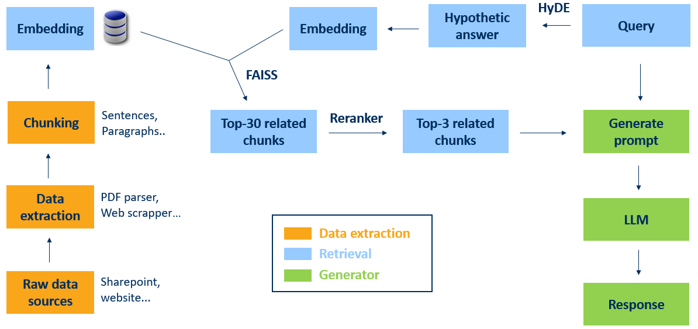

# RAG (Retrieval-Augmented Generation)
Document-based search and answer generation system for Satlantis.

## Configuration and Installation

### 1. Install dependencies
```bash
pip install -r requirements.txt
```

### 2. Configuration 
Modify settings in `config.py`:
- Data paths (`RAW_DATA_FOLDER`, `PROCESSED_DATA_FOLDER`) 
- RAG settings like top_k chunks, quantization...

### 3. Hugging Face Token
Create a `.env` file with your token:
```
HF_TOKEN=your_hugging_face_token
```

## Usage

### Data preparation (required at start)
```bash
# Download websites AND create embeddings (first time)
python process_data.py --all

# Or separately:
python process_data.py --scrape     # Downloads Satlantis websites as .txt
python process_data.py --chunks     # Splits documents into chunks
python process_data.py --embeddings # Computes embeddings (vectorization)
```

### Web Interface (recommended)
1. **Start Angular frontend:**
   ```bash
   cd Chatlantis
   ng serve
   ```

2. **Start API backend:**
   ```bash
   python deploy_production.py
   ```

### Terminal only
```bash
python rag.py "Your question here"
```

## How it works

1. **Scraping**: Downloads content from Satlantis websites
2. **Chunking**: Splits documents into chunks
3. **Embeddings**: Converts chunks into numerical vectors
4. **Search**: Finds the most relevant chunks for your question
5. **Generation**: Generates answer based on found documents

## Models used
- **HyDE & Generation**: microsoft/Phi-4-mini-instruct
- **Embeddings**: intfloat/multilingual-e5-large-instruct  
- **Search**: FAISS
- **Reranking**: BAAI/bge-reranker-v2-m3

## Architecture

